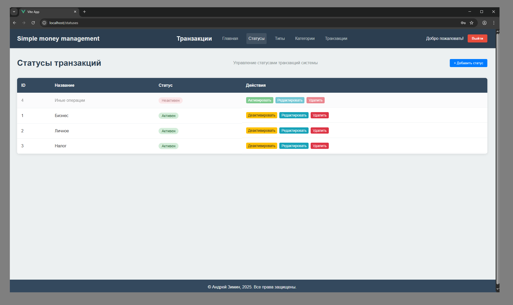
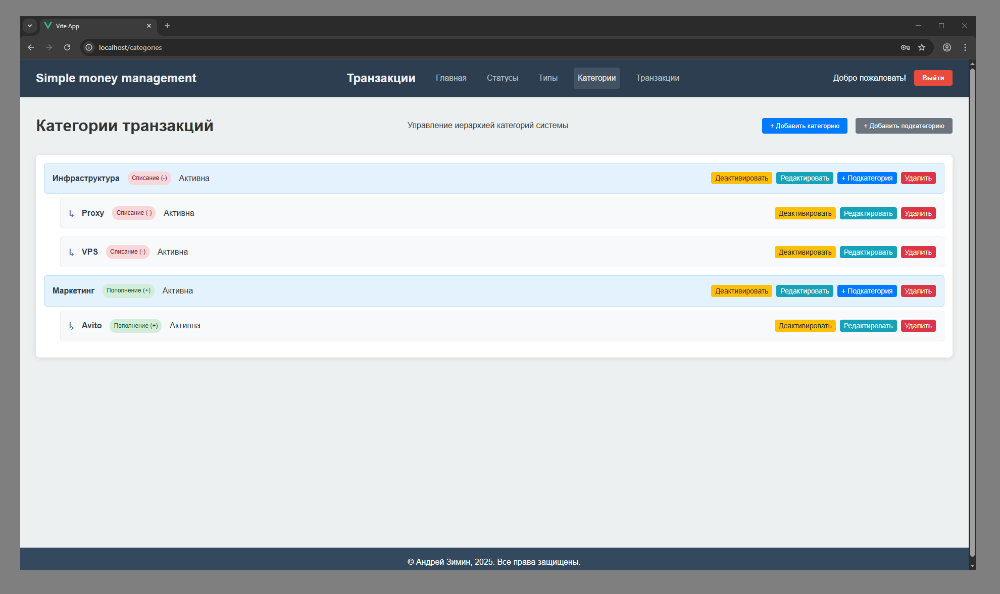

# SimpleMoneyManagement

**Simple Money Management - это веб-приложение с бэкендом на Django REST Framework и фронтендом на Vue.js 3, контейнеризированное с использованием Docker Compose.**

**Веб-приложение позволяет пользователям
создавать, редактировать, удалять и просматривать записи о движении денежных
средств.**
## Технологии

### Backend: 
    
<div style="display: flex; align-items: center; justify-content: left; gap: 10px;">
    
    <span>Django 5.2.6;</span>
</div>
<p></p>
<div style="display: flex; align-items: center; justify-content: left; gap: 10px;">
    
    <span>Django REST Framework 3.16.1</span>
</div>

### Frontend:

<div style="display: flex; align-items: center; justify-content: left; gap: 10px;">
    
    <span>Vue.js 3, Vue Router</span>
</div>
<p></p>
<div style="display: flex; align-items: center; justify-content: left; gap: 10px;">
    
    <span>Vite</span>
</div>
<p></p>
<div style="display: flex; align-items: center; justify-content: left; gap: 10px;">
    
    <span>TypeScript</span>
</div>

### База данных:

<div style="display: flex; align-items: center; justify-content: left; gap: 10px;">
    
    <span>SQLite</span>
</div>

### Контейнеризация: 

<div style="display: flex; align-items: center; justify-content: left; gap: 10px;">
    
    <span>Docker, Docker Compose</span>
</div>

### Web-server: 

<div style="display: flex; align-items: center; justify-content: left; gap: 10px;">
    
    <span>Nginx</span>
</div>

## Требования

    Docker 20.10+

    Docker Compose 2.0+

    Git

## Установка и запуск
**1. Клонирование репозитория**

```
git clone https://github.com/J0hnLenin/SimpleMoneyManagement
cd SimpleMoneyManagement
```
**2. Настройка переменных окружения**

Создайте файл .env в корневой директории проекта на примере файла
.env.example  
Измените переменные окружения:
```
SECRET_KEY=your-secret-key
DJANGO_SUPERUSER_USERNAME=admin
DJANGO_SUPERUSER_PASSWORD=admin
```

**3. Запуск приложения**

Запуск в detached mode
```
docker-compose up -d --build
```
Запуск с просмотром логов:
```
docker-compose up --build
```

**4. Проверка работы**

После запуска контейнеров приложение будет доступно:

Frontend (Vue.js): [http://localhost](http://localhost)

Backend (Django API): [http://localhost/api/v1](http://localhost/api/v1)

Django Admin: [http://localhost/admin](http://localhost/admin)

## Структура проекта
```
SimpleMoneyManagement/
├── backend/
│   ├── Dockerfile
│   ├── requirements.txt
│   ├── manage.py
│   ├── create_superuser.py
│   └── ... (файлы Django)
├── frontend/
│   ├── Dockerfile
│   ├── package.json
│   ├── vite.config.ts
│   └── ... (файлы Vue.js)
├── nginx/
│   └── nginx.conf
├── docker-compose.yml
├── .env
├── .env.example
└── README.md
```

## REST API endpoints

- api/v1/main/users/
- api/v1/main/groups/
- api/v1/transactions/statuses/
- api/v1/transactions/transaction-types/
- api/v1/transactions/categories/
- api/v1/transactions/transactions/

## Интерфейс веб-приложения

### Админ-панель Django


### Страница Django REST API


### Пользовательский интерфейс

**1. Главная страница**


**2. Страница статусов**




**3. Страница типов транзакций**


**4. Страница категорий**




**5. Страница транзакций**


